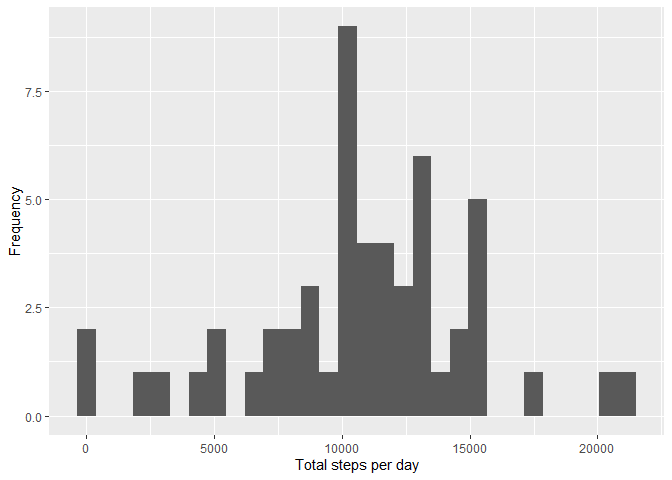
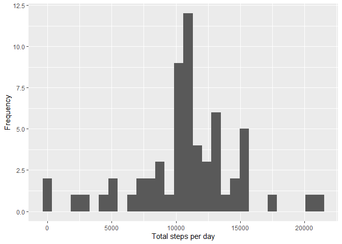

## Loading required libraries

```r
library(dplyr)
library(ggplot2)
library(chron)
```

```
## Warning: package 'chron' was built under R version 3.6.3
```

## Loading and preprocessing the data

1. Load the data (i.e. read.csv())

```r
activity <- read.csv(unz("activity.zip", "activity.csv"))
```

2. Process/transform the data (if necessary) into a format suitable for your analysis

```r
activity$date <- as.Date(activity$date)
summary(activity)
```

```
##      steps             date               interval     
##  Min.   :  0.00   Min.   :2012-10-01   Min.   :   0.0  
##  1st Qu.:  0.00   1st Qu.:2012-10-16   1st Qu.: 588.8  
##  Median :  0.00   Median :2012-10-31   Median :1177.5  
##  Mean   : 37.38   Mean   :2012-10-31   Mean   :1177.5  
##  3rd Qu.: 12.00   3rd Qu.:2012-11-15   3rd Qu.:1766.2  
##  Max.   :806.00   Max.   :2012-11-30   Max.   :2355.0  
##  NA's   :2304
```


## What is mean total number of steps taken per day?

1. Calculate the total number of steps taken per day

```r
totalStepsPerDay <- activity %>% 
                                 filter(!is.na(steps)) %>% 
                                 group_by(date) %>% 
                                 summarise(steps = sum(steps))
```

2. Make a histogram of the total number of steps taken each day

```r
qplot(steps, data=totalStepsPerDay, xlab='Total steps per day', ylab='Frequency')
```

<!-- -->

3. Calculate and report the mean and median of the total number of steps taken per day

```r
stepsPerDayMean <- mean(totalStepsPerDay$steps)
stepsPerDayMedian <- median(totalStepsPerDay$steps)
```
* mean: 10766.1886792
* median: 10765

## What is the average daily activity pattern?

1. Make a time series plot (i.e. type = "l") of the 5-minute interval (x-axis) and the average number of steps taken, averaged across all days (y-axis)

```r
avgPerInterval <- activity %>% 
                               filter(!is.na(steps)) %>% 
                               group_by(interval) %>% 
                               summarise(steps = mean(steps))
qplot(interval, steps, data=avgPerInterval, geom=c("line"), xlab='5-minute intervals', ylab='average number of steps')
```

<!-- -->

2. Which 5-minute interval, on average across all the days in the dataset, contains the maximum number of steps?

```r
maxAvgSteps <- max(avgPerInterval$steps)
maxAvgInterval <- avgPerInterval[which(avgPerInterval$steps==maxAvgSteps),1]
```
The 5-minute interval 8:35 has, on averange across all the days in the dataset, the maximum number of steps 206.1698113.

## Imputing missing values

1. Calculate and report the total number of missing values in the dataset (i.e. the total number of rows with NAs)

```r
sumNAs <- sum(is.na(activity))
```
The total number of missing values is 2304.

2. Devise a strategy for filling in all of the missing values in the dataset. The strategy does not need to be sophisticated.

```r
NA2mean <- function(x) replace(x, is.na(x), mean(x, na.rm = TRUE))
```
Replace NA values by the mean of the entire data set

3. Create a new dataset that is equal to the original dataset but with the missing data filled in.

```r
activityNoNA <- activity
activityNoNA[] <- lapply(activityNoNA, NA2mean)
```

4. Make a histogram of the total number of steps taken each day and Calculate and report the mean and median total number of steps taken per day. Do these values differ from the estimates from the first part of the assignment? What is the impact of imputing missing data on the estimates of the total daily number of steps?

```r
totalStepsPerDayNoNA <- activityNoNA %>% 
                                         group_by(date) %>% 
                                         summarise(steps = sum(steps))
qplot(steps, data=totalStepsPerDayNoNA, xlab='Total steps per day', ylab='Frequency')
```

<!-- -->

```r
stepsPerDayMeanNoNA <- mean(totalStepsPerDayNoNA$steps)
stepsPerDayMedianNoNA <- median(totalStepsPerDayNoNA$steps)
```
This time the mean and median are respectively 10766.1886792 and 10766.1886792. Compared to the previous mean and median of 10766.1886792 and 10765, we can conlclude that the new mean and median are equal to the previous mean because of replacing NAs with the mean.

## Are there differences in activity patterns between weekdays and weekends?

1. Create a new factor variable in the dataset with two levels – “weekday” and “weekend” indicating whether a given date is a weekday or weekend day.

```r
activityNoNA$part_of_week <- factor(is.weekend(activityNoNA$date), levels=c(TRUE, FALSE), labels=c('weekend', 'weekday'))
```

2. Make a panel plot containing a time series plot of the 5-minute interval (x-axis) and the average number of steps taken, averaged across all weekday days or weekend days (y-axis).

```r
avgPerIntervalNoNA <- activityNoNA %>% 
                                       group_by(part_of_week, interval) %>% 
                                       summarise(steps = mean(steps))
qplot(interval, steps, data=avgPerIntervalNoNA, geom=c("line"), xlab='5-minute intervals', ylab='average number of steps') + facet_grid(part_of_week ~ .)
```

<!-- -->
